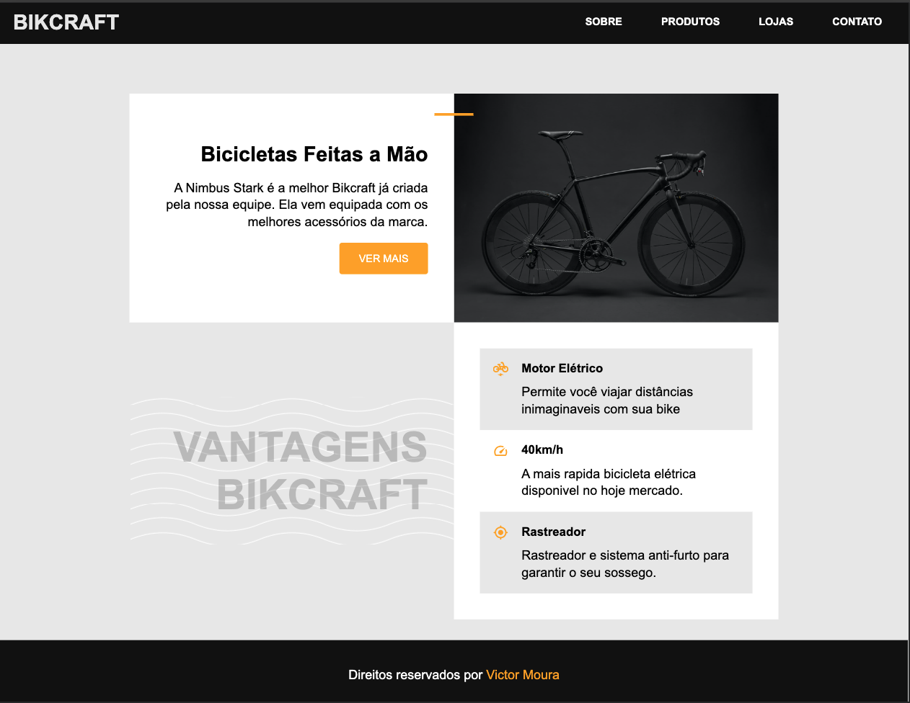
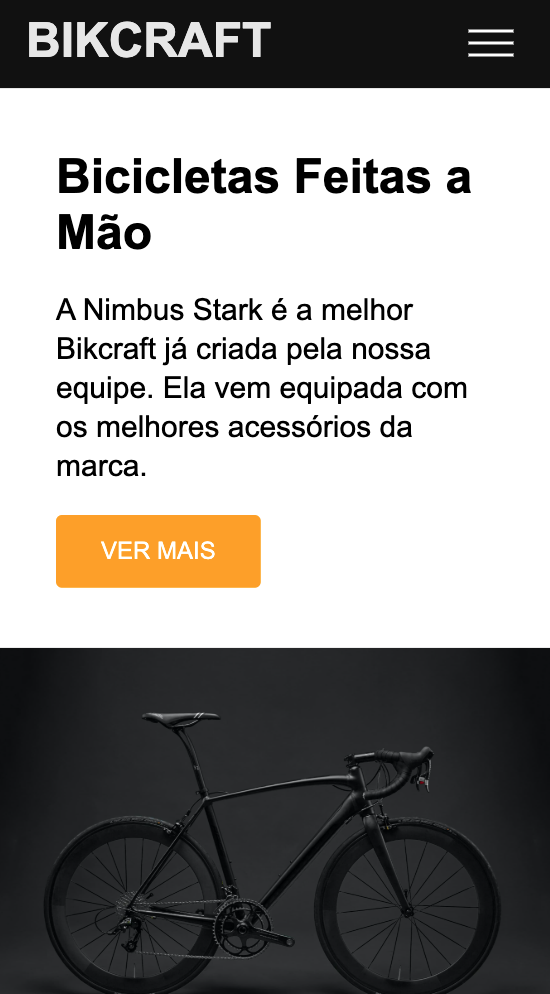
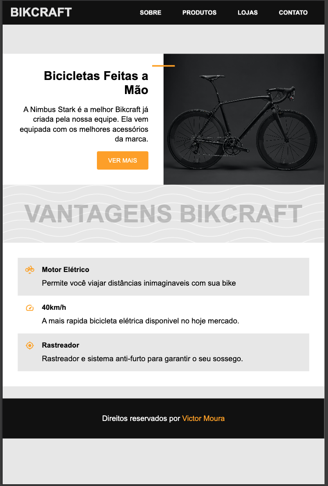

# 🚲 Bikcraft

Bikcraft é um site responsivo e moderno que apresenta uma linha de bicicletas feitas à mão com alta qualidade, design refinado e recursos avançados.

## 📸 Capturas de Tela

### 💻 Desktop


### 📱 Mobile


### 📱 Tablet


## 🔍 Visão Geral

O projeto tem como foco a apresentação de bicicletas personalizadas de forma clara e atrativa, com foco em usabilidade e performance em múltiplas plataformas (desktop, tablet e mobile).

## 🎯 Funcionalidades

- Layout 100% responsivo.
- Seções principais:
  - **Apresentação do produto** com botão de ação.
  - **Vantagens do produto**, com ícones e descrições.
  - **Rodapé com créditos.**
- Navegação simplificada com menu fixo no topo.

## 🛠️ Tecnologias Utilizadas

- HTML5
- CSS3 (Flexbox + Grid)
- Design adaptado para todos os tamanhos de tela (media queries)

## 🚀 Como usar

1. Clone o repositório:
   ```bash
   git clone https://github.com/seu-usuario/bikcraft.git
   ```
2. Acesse a pasta do projeto:
   ```bash
   cd bikcraft
   ```
3. Abra o `index.html` no seu navegador.

## 📱 Responsividade

O layout foi pensado para funcionar perfeitamente em:

- **Desktop**
- **Tablets**
- **Smartphones**

---

## 📌 Créditos

Desenvolvido por **Victor Moura**
